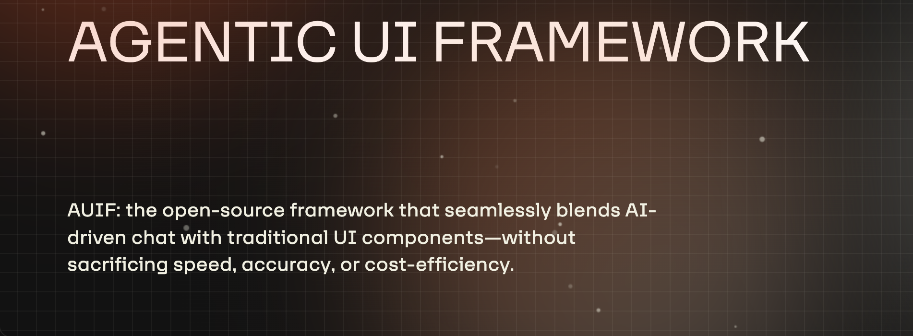

# AUIF - Agentic UI Framework

**Agentic UI Framework** is an Open-Source UI framework designed to create intuitive graphics and click-based interactions, seamlessly integrated with a chat agent.

It is made of two main components:

1. **Glow (Graph Flow)** – a chat agent framework that lets users interact with the system using natural language.
2. **Agentic UI** – a UI framework that integrates Glow directly into the graphical interface, allowing users to switch seamlessly between text/voice-based and click-based interactions.

The **Glow** framework handles these core functionalities:

1. **Context Engineering** – Enhances the context with similarity-based augmentation (RAG) to improve relevance during interactions.
2. **Prompt Engineering** – Manages dynamic system prompts-per-node using a visual, graph-based approach (via Mermaid Charts).
3. **Tool Calls** – Manage dynamic tools-per-node, letting you define tools with existing APIs using a no-code approach. 
4. **Deterministic Actions** – Seamlessly triggers predefined actions and text responses (pre-caching) through the chat interface.

The **Agentic UI** framework handles:

1. **Readymade React Component Framework** – A modular system for building chat UIs like LEGO blocks. It supports custom theming and branding, and lets you reuse or swap out only the necessary parts depending on your project needs.
2. **Communication Layer** – Manages the interaction between the chat agent and the UI, while keeping both independent. This makes it possible to run them separately, such as having a chat-only interface on mobile.
3. **AI2UI integration** – The communication layer lets the AI and GUI work as one: UI clicks can trigger chat replies, and chat responses can update the GUI.

# Why AUIF matters?
When chat-based LLMs were first introduced, the promise was to transform how we interact with computer systems and websites.
The idea was simple: instead of clicking through complex menus and buttons trying to figure out how to complete a task, we could just tell the system what we wanted—and it would guide us through the process instantly.

However, this promise never fully materialized, mainly due to a few key limitations:

1. **Speed** – AI token generation is significantly slower compared to the responsiveness of modern click-based UIs.
2. **Cost** – Generating tokens is expensive and often unnecessary when actions and responses can be pre-defined and cached in advance.
3. **Deterministic Actions** – While AI is inherently non-deterministic, UI systems require predictable, repeatable outcomes. There must be a seamless transition between AI-driven and deterministic behaviors.
4. **Process Guidance** – Current chat-based LLMs rely on the user to lead the interaction. But for multi-step processes with interdependent stages, we need the AI to guide the user step-by-step, providing instructions for each required action.
5. **Limited Context** – While LLMs possess broad general knowledge, they lack specific awareness of your system’s unique context. To be useful, this context must be injected dynamically into the chat system (RAG).

**AUIF** aims to solve all these challenges *heads-on* by offering a complete framework that addresses each limitation. It supports both code-based and no-code implementations, making it flexible for different use cases.
* You can integrate **AUIF** into your existing website using a third-party **AUIF provider**
* Or manually craft your own custom UI experience.

# **How is AUIF Different?**
One key insight behind **AUIF** is that integrating an AI chat system into a product differs significantly from general-purpose AI chats like ChatGPT. In most product interactions, user actions are often predictable and can be guided through structured elements like buttons, clickable text, and suggested prompts.

The core realization was this:
> We can **pre-cache responses** for common, anticipated user actions. Then, by using **semantic similarity**, the chat engine can intelligently and seamlessly switch between fully AI-generated responses and deterministic, predefined ones.

This hybrid approach gives users the flexibility of natural language while maintaining the speed, reliability, and cost-efficiency of deterministic UI behavior.

Another key insight is the **Glow (Graph Flow)** approach, which uses **Mermaid charts** to guide chat interactions. This serves as a bridge between two essential needs:
- **Human Need**: A visual, interactive UI to understand and manage process flow.
- **AI Need**: A clear, text-based definition of how to navigate between steps.

Each node in the **Glow** graph can have its own tools and instructions assigned. This allows the implementor to **micro-manage** the user journey in a way that feels both intuitive and structured. It also ensures the AI stays focused—only using instructions and tools relevant to the **current node**—avoiding confusion or incorrect tool usage.

One of the biggest advantages of the **Glow** system is its **no-code design**. It includes a built-in AI assistant that can generate Graph Flow charts using natural language, making the setup fast and simple—no complex code required.

> Unlike other frameworks like **LangGraph**, where a developer must manually code the transitions between nodes, **Glow** manages transitions automatically. The AI interprets the Mermaid chart and node-specific instructions to decide when and how to move between nodes. This automatically updates the system prompt and available tools, creating a dynamic, responsive, and user-friendly experience.

# **The Grand Vision**
**AUIF** is designed to revolutionize how UI systems are built by providing a **simple yet complete framework** that integrates AI into modern GUIs. The goal is to empower developers and teams to seamlessly blend AI-driven chat interactions with traditional UI components—**without sacrificing speed, cost-efficiency, or accuracy**.

At the heart of this vision is the ability to **intelligently switch between deterministic and AI-based interactions**, offering the best of both worlds: the predictability and responsiveness of conventional UIs and the flexibility and natural language understanding of AI systems.

**AUIF**’s unified approach enables:
- **Faster user journeys** through pre-cached actions and UI integration
- **Scalable deployment** via both code and no-code options
- **Custom UI experiences** that work seamlessly across devices

Whether you’re using a plug-and-play third-party **AUIF provider** or building your interface from the ground up, **AUIF provides** the tools to integrate AI into your system in a way that’s intuitive, efficient, and future-ready.

# **The Future of AUIF**
**AUIF** is set to transform systems into fully **agentic interfaces**, enabling a wide spectrum of interaction models that go beyond traditional UI or isolated chatbots. 
The vision is to make every system smart, responsive, and intuitive by allowing different modes of engagement:
### **1.**  **AI2UI Integration**
Users can fluidly move between **graphical user interfaces** and **text-based (chat) interactions**. Whether it’s clicking buttons or typing a command, **AUIF** handles both seamlessly—merging the speed of GUI with the flexibility of AI chat.
### **2.** **Chat-Based Mode**
Ideal for **mobile-first or on-the-go** scenarios. For example, an employee driving to a client site could use voice to instruct the AI: _“Create a new expense entry for lunch with client XYZ.”_ **AUIF** supports this lightweight, conversational mode while maintaining system consistency and determinism.
### **3.**  **Agent2Agent Interaction**
**AUIF** also envisions agents communicating with each other using a **natural language protocol**. For example:
- A **browser plugin agent** could query the website agent for available actions.
- An agent might ask: _“What actions are available for user onboarding?”_ or _“Guide me through a multi-step API key creation process.”_
- This could unlock **new economic models**, such as **micropayments per agent interaction**, where systems charge for each automated action completed by an external agent.

---
### **In Summary**
**AUIF** isn’t just about better UI—it’s about **redefining how users, agents, and systems collaborate**. By supporting AI-driven chat, visual UI, and agent-to-agent protocols, it paves the way for a future where systems are not only usable—but intelligently interactive and self-navigating.

# Can I see this in action NOW?
Yes! You can already try out a live, early implementation of **AUIF** on the [**AgentUI website**](http://auif.app/).
### **🔹 What You’ll See on AgentUI.live**

- The **main page** features a working demo of an **Agentic UI** for end users. You’ll experience how chat and traditional UI merge seamlessly into a single interface.
    
- It also acts as a **live AUIF provider**—meaning **you can craft your own AgentUI Agent** using the **AUIF** methodology. 

This includes:
* **Plug-and-play no-code AgentUI agent creation** using graph-based flow design
	* Includes ready-made client-side tools for click-based, widget-style chat interactions
	* Define your own API-based tools without writing any code
* **Branding and embedding** a ready-made UI bot into your website
	*  Instant deployment to your website or as a standalone chatbot
* **Creating a knowledge base** for your AI to answer based on your specific data
	* Includes a **web crawler** to automatically turn your public website into a searchable knowledge base
* **Pre-caching responses** for deterministic interactions
* **Access control** to manage who can view or edit your bot
	* Supports both public bots and private ACL-based access
* **Integration with existing platforms** like n8n, Make, or WhatsApp
* **Visibility and analytics** to monitor user interactions, questions, and bot responses—helping you improve your bot iteratively
* **Comprehensive video tutorials** to walk you through creating your own unique chatbot experience
* A **generous free plan** to try it out—no credit card, no commitments, no strings attached

